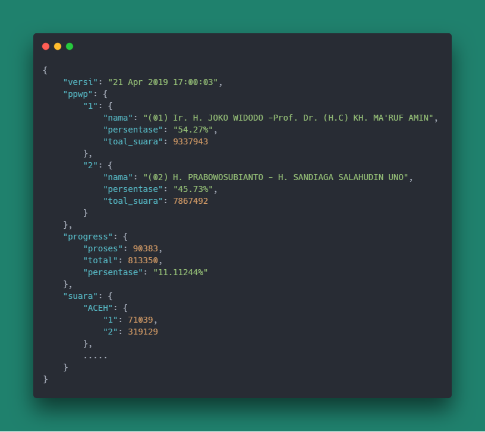

### Pemilu2019 Web Scraper

API for Pemilu 2019 Nasional

Source https://pemilu2019.kpu.go.id/#/ppwp/hitung-suara/

#### Instalation
```bash
npm install
```

```bash
npm run start
```
#### Result
<p align="center"></p>

The project use:
- NodeJS
- Express
- [Puppeteer](https://github.com/GoogleChrome/puppeteer "Puppeteer") (headless browser library for generate pre-rendered content)